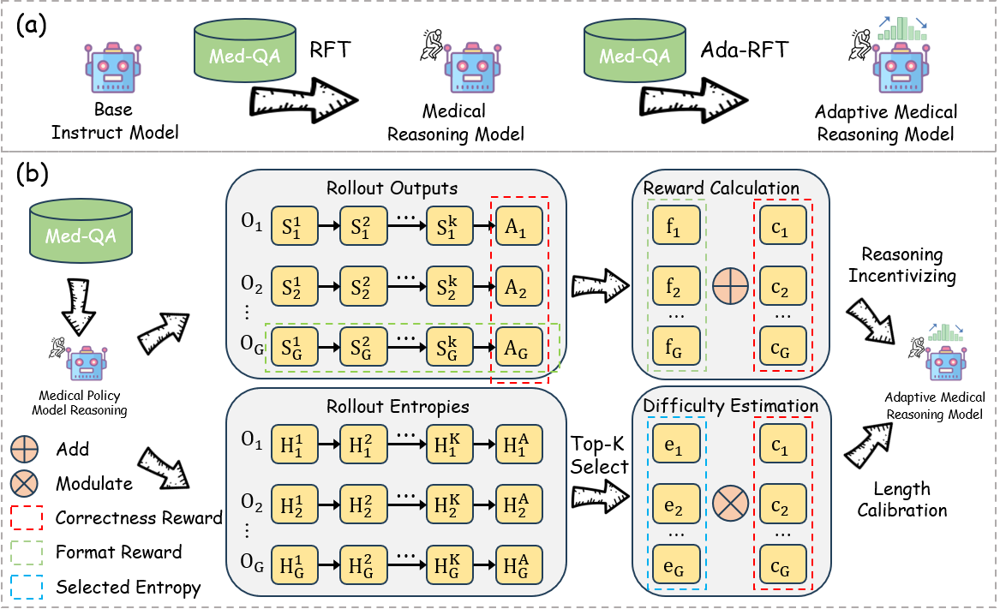
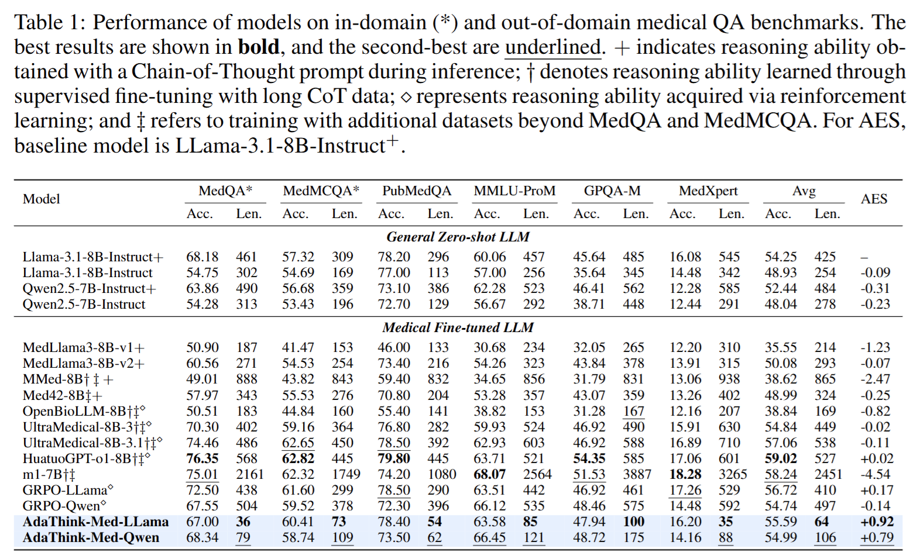
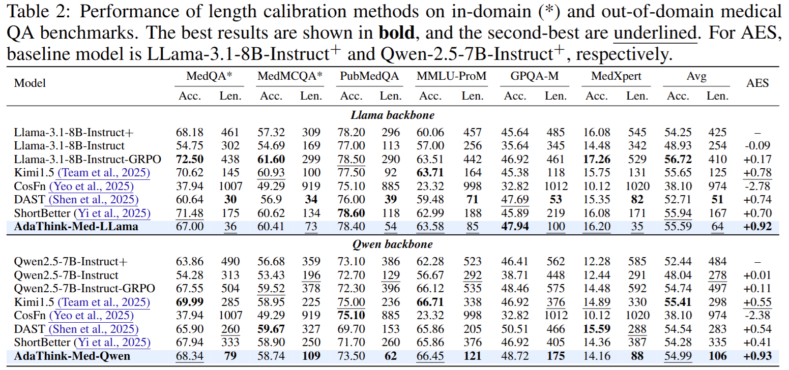
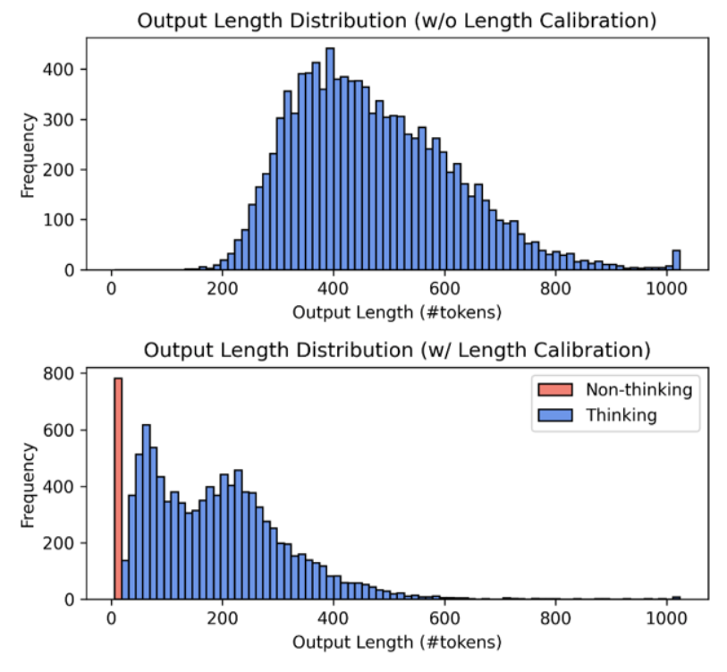

# AdaThink-Med: Medical Adaptive Thinking with Uncertainty-Guided Length Calibration

This repository contains the official implementation of our paper:  
**AdaThink-Med: Medical Adaptive Thinking with Uncertainty-Guided Length Calibration**  
The first end-to-end framework designed to enhance adaptive thinking ability in medical reasoning models with **uncertainty-guided length calibration**.

Paper: [OpenReview](https://openreview.net/pdf?id=zlJehQJATy) | [arXiv](https://arxiv.org/abs/2509.24560)

---

## 📖 Introduction
AdaThink-Med aims to improve reasoning in medical AI systems by adaptively controlling the reasoning process length.  
Instead of relying on fixed reasoning steps, our method leverages **uncertainty-guided calibration** to dynamically adjust the reasoning length, leading to more accurate and efficient medical decision-making.

<p align="center">
  
</p>

---


## 📊 Main Results
Our framework achieves **state-of-the-art performance** across multiple medical reasoning benchmarks.

<p align="center">
  
</p>

---

## 🔍 Comparison with Calibration Methods
We compare AdaThink-Med against existing length calibration methods, showing consistent improvements.

<p align="center">
  
</p>

---

## 🧠 Emergence of Reasoning Modes
Our approach enables the **emergence of distinct reasoning modes** (think vs. non-think).

<p align="center">
  
</p>

---

## Setup
1. **Download Dataset**  
   First, download the **Alphamed19k** dataset and place it in the `MedicalDataset/` directory.

2. **GRPO Training**  
   Perform GRPO training to obtain the medical reasoning model:  
   ```sh
   bash examples/qwen_alphamed19k_grpo.sh
   ```
3. **Adaptive Training**  
    Run adaptive training to further enhance adaptive medical reasoning.

```sh
#!/bin/bash
export PATH=/opt/conda/bin:/opt/conda/condabin:/etc/inspire/node/bin:/opt/conda/bin:/usr/local/nvidia/bin:/usr/local/cuda/bin:/usr/local/sbin:/usr/local/bin:/usr/sbin:/usr/bin:/sbin:/bin
export LD_LIBRARY_PATH=/usr/local/nvidia/lib:/usr/local/nvidia/lib64
source ~/.bashrc
conda init
conda activate verl
source activate verl
set -x
ray stop
export WANDB_MODE=offline
export PYTHONUNBUFFERED=1
MODEL_PATH=checkpoints/qwen_alphamed_19k_vinilla_grpo/global_step_300/actor/huggingface 

OFF_LOAD=false
PROJ_NAME=QWEN_adaptive_from_grpo

THETA=0.7
TOPK=0.2
ALPHA=0.5
BETA=0
VERSION='v7'
EXTRO_NAME='default'
ADA_METHOD='ours'

for i in "$@"; do
  [[ $i == --topk=* ]] && TOPK="${i#*=}"
  [[ $i == --theta=* ]] && THETA="${i#*=}"
  [[ $i == --alpha=* ]] && ALPHA="${i#*=}"
  [[ $i == --beta=* ]] && BETA="${i#*=}"
  [[ $i == --version=* ]] && VERSION="${i#*=}"
  [[ $i == --extro_name=* ]] && EXTRO_NAME="${i#*=}"
  [[ $i == --ada_method=* ]] && ADA_METHOD="${i#*=}"
done

EXP_NAME=qwen_theta_${THETA}_topk_${TOPK}_alpha_${ALPHA}_beta_${BETA}_reward_${ADA_METHOD}_${VERSION}_${EXTRO_NAME}
mkdir -p tensorboard_log/$PROJ_NAME/$EXP_NAME


NUM_GPUS=8

ray start --head --node-ip-address 127.0.0.1 --num-gpus $NUM_GPUS --port 8263
python3 -m verl.trainer.main \
    config=examples/config_grpo.yaml \
    data.debug=false \
    data.debug_data_size=100 \
    data.train_files=MedicalDataset/AlphaMed19K/train19k.parquet \
    data.val_files=MedicalDataset/AlphaMedTest/updated_test.json \
    data.prompt_key=question \
    data.answer_key=answer \
    data.max_prompt_length=512 \
    data.max_response_length=2048 \
    data.val_batch_size=2048 \
    data.rollout_batch_size=256 \
    worker.actor.global_batch_size=128 \
    data.format_prompt=examples/format_prompt/box.jinja \
    data.filter_overlong_prompts=false \
    algorithm.use_entropy=true \
    worker.actor.clip_ratio_low=0.2 \
    worker.actor.clip_ratio_high=0.28 \
    worker.actor.offload.offload_params=$OFF_LOAD \
    worker.actor.offload.offload_optimizer=$OFF_LOAD \
    worker.actor.micro_batch_size_per_device_for_update=8 \
    worker.actor.micro_batch_size_per_device_for_experience=16 \
    worker.actor.model.model_path=$MODEL_PATH \
    worker.rollout.n=8 \
    worker.rollout.temperature=1.0 \
    worker.rollout.top_p=0.99 \
    worker.rollout.gpu_memory_utilization=0.65 \
    worker.rollout.tensor_parallel_size=4 \
    worker.reward.reward_type=ada_think \
    worker.reward.reward_function=./examples/reward_function/box.py:compute_score \
    worker.reward.length_reward_method=$ADA_METHOD \
    worker.reward.difficulty_threshold=$THETA \
    worker.reward.alpha=$ALPHA \
    worker.reward.beta=$BETA \
    worker.reward.method_version=$VERSION \
    worker.reward.entropy_topk=$TOPK \
    trainer.max_steps=200 \
    trainer.project_name=$PROJ_NAME \
    trainer.experiment_name=$EXP_NAME \
    trainer.n_gpus_per_node=$NUM_GPUS \
    trainer.val_freq=-1 \
    trainer.val_before_train=false \
    trainer.val_only=false \
    trainer.val_generations_to_log=10 \
    trainer.save_freq=20 \
    trainer.save_limit=-1 \
    2>&1 | tee tensorboard_log/$PROJ_NAME/$EXP_NAME/log.txt

```

---
## 💾 Model Weights
Model weights and additional artifacts will be released separately.

## Citation

If you find **AdaThink-Med** useful for your research, please cite our paper:

```bibtex
@article{rui2025adathink,
  title={AdaThink-Med: Medical Adaptive Thinking with Uncertainty-Guided Length Calibration},
  author={Rui, Shaohao and Chen, Kaitao and Ma, Weijie and Wang, Xiaosong},
  journal={arXiv preprint arXiv:2509.24560},
  year={2025}
}
```

## 🙌 Acknowledgements
We thank the community for prior works on adaptive reasoning and calibration, which inspired this study. A lot of codes are modified from verl.
